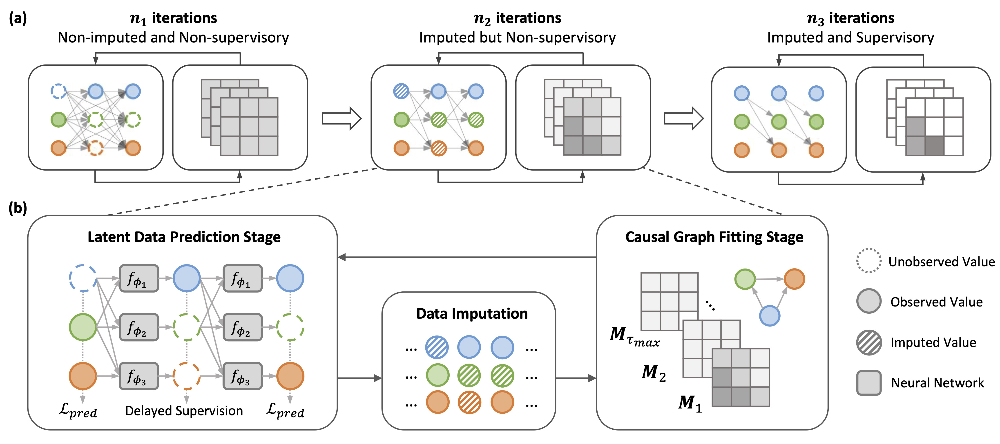
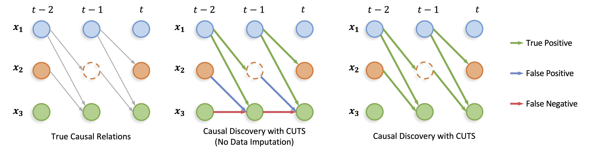

## 🚩 CUTS: Neural Causal Discovery from Irregular Time-Series Data

[ICLR 2023](https://openreview.net/forum?id=UG8bQcD3Emv) | [Latest Version](../CUTS/CUTS_ver0324_camera5.pdf) | [Tutorial (Coming Soon) ](https://colab.research.google.com/) 

### ✍️ Paper summary

Causal discovery from time-series data has been a central task in machine learning. Recently, Granger causality inference is gaining momentum due to its good explainability and high compatibility with emerging deep neural networks. However, most existing methods assume structured input data and degenerate greatly when encountering data with randomly missing entries or non-uniform sampling frequencies, which hampers their applications in real scenarios.  

To address this issue, here we present **CUTS**, a neural Granger causal discovery algorithm to jointly impute unobserved data points and build causal graphs, via plugging in two mutually boosting modules in an iterative framework:
1. **Latent data prediction stage:** designs a Delayed Supervision Graph Neural Network (DSGNN) to hallucinate and register irregular data which might be of high dimension and with complex distribution;
2. **Causal graph fitting stage:** builds a causal adjacency matrix with imputed data under sparse penalty.

Experiments show that CUTS effectively infers causal graphs from irregular time-series data, with significantly superior performance to existing methods. *Our approach constitutes a promising step towards applying causal discovery to real applications with non-ideal observations.*

### Requirements

Please see [requirements.txt](../requirements.txt).

### Example

We created a simple tutorial that addresses causal discovery on a three-node dataset [`cuts_example.ipynb`](../CUTS/cuts_example.ipynb). 

More examples will be available in the future.

### 😘 Citation
If you use this code, please consider citing [our work](https://openreview.net/forum?id=UG8bQcD3Emv).
