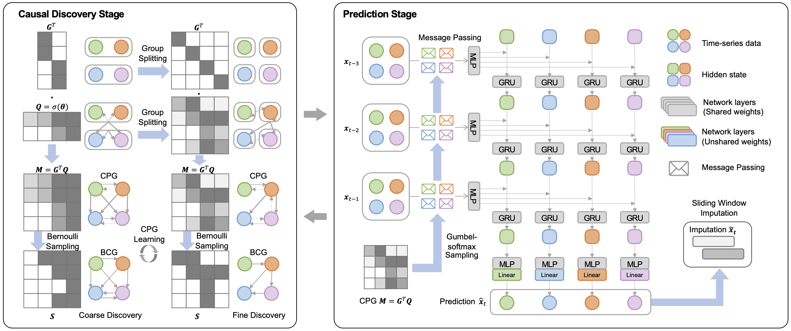

## 🎄CUTS+: High-dimensional Causal Discovery from Irregular Time-series
[AAAI-24](https://ojs.aaai.org/index.php/AAAI/article/view/29034) | [Tutorial (Coming Soon) ](https://colab.research.google.com/) | [Supplementary Materials](CUTS_Plus/github_files/CUTS_Plus_Supp_ver1214.pdf) 

### ✍️ Paper summary

Recently, researchers successfully discover causality by combining neural networks with Granger causality, but their performances degrade largely when encountering high-dimensional data because of the highly redundant network design and huge causal graphs. Moreover, the missing entries in the observations further hamper the causal structural learning. 

To overcome these limitations, We propose CUTS+, which is built on the Granger-causality-based causal discovery method CUTS and raises the scalability by introducing a technique called Coarse-to-fine-discovery (C2FD) and leveraging a message-passing-based graph neural network (MPGNN). Compared to previous methods on simulated, quasi-real, and real datasets, we show that CUTS+ largely improves the causal discovery performance on high-dimensional data with different types of irregular sampling.

### Requirements

Please see [requirements.txt](requirements.txt).

### Example

We created a simple tutorial that addresses causal discovery on a 128-node lorenz-96 dataset [`cuts_plus_example.ipynb`](../CUTS_Plus/cuts_plus_example.ipynb). More examples will be available in the future.

### 😘 Citation
If you use this code, please consider citing [our work](https://arxiv.org/abs/2305.05890).
