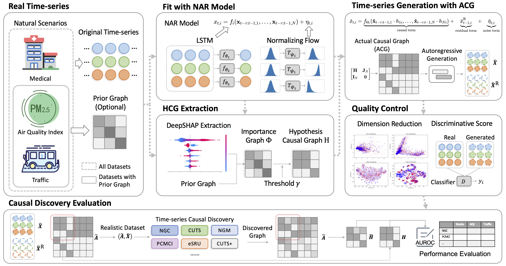
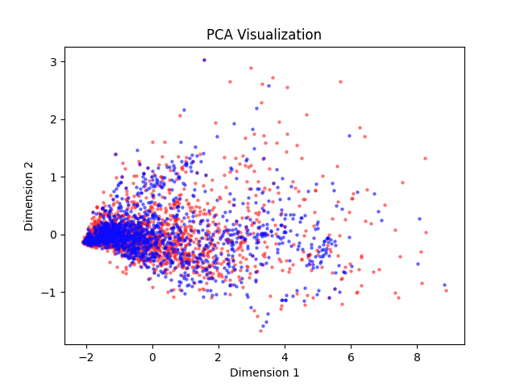
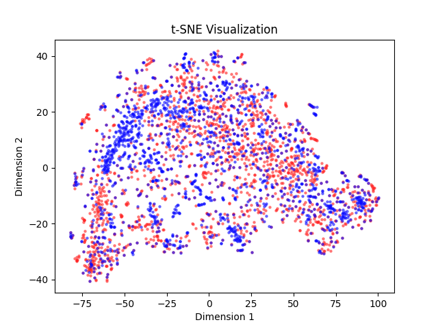

## 🍺 CausalTime: Realistically Generated Time-series for Benchmarking of Causal Discovery


[arXiv](https://arxiv.org/abs/2310.01753) ｜ [Official Website](https://www.causaltime.cc/) ｜ [Dataset Download](https://www.causaltime.cc/dataset/)


### ✍️ Paper summary

Time-series causal discovery (TSCD) is a fundamental problem of machine learning. However, existing synthetic datasets cannot properly evaluate or predict the algorithms' performance on real data. This study introduces the CausalTime pipeline to generate time-series that highly resemble the real data and with ground truth causal graphs for quantitative performance evaluation. The pipeline starts from real observations in a specific scenario and produces a matching benchmark dataset. 

Firstly, we harness deep neural networks along with normalizing flow to accurately capture realistic dynamics. Secondly, we extract hypothesized causal graphs by performing importance analysis on the neural network or leveraging prior knowledge. Thirdly, we derive the ground truth causal graphs by splitting the causal model into causal term, residual term, and noise term. Lastly, using the fitted network and the derived causal graph, we generate corresponding versatile time-series proper for algorithm assessment. In the experiments, we validate the fidelity of the generated data through qualitative and quantitative experiments, followed by a benchmarking of existing TSCD algorithms using these generated datasets. CausalTime offers a feasible solution to evaluating TSCD algorithms in real applications and can be generalized to a wide range of fields. For easy use of the proposed approach, we also provide a user-friendly website, hosted on www.causaltime.cc.

<center></center>

### Usage

Install the dependencies. Run the following command to install all the dependencies listed in the `requerment.txt` file:

```shell
pip install -r requerment.txt
```

This will automatically install all the required packages using the pip tool.

Once the installation is complete, you can directly run the demo. Depending on your specific case, the demo could be a Python script file, a module containing the main program, or any other form of executable file. Run the following command to launch the demo:

```shell
python demo.py
```

By following these steps, installing all the dependencies, and running the demo directly, you should be able to successfully find outputs in './outputs'.

### Visualization


