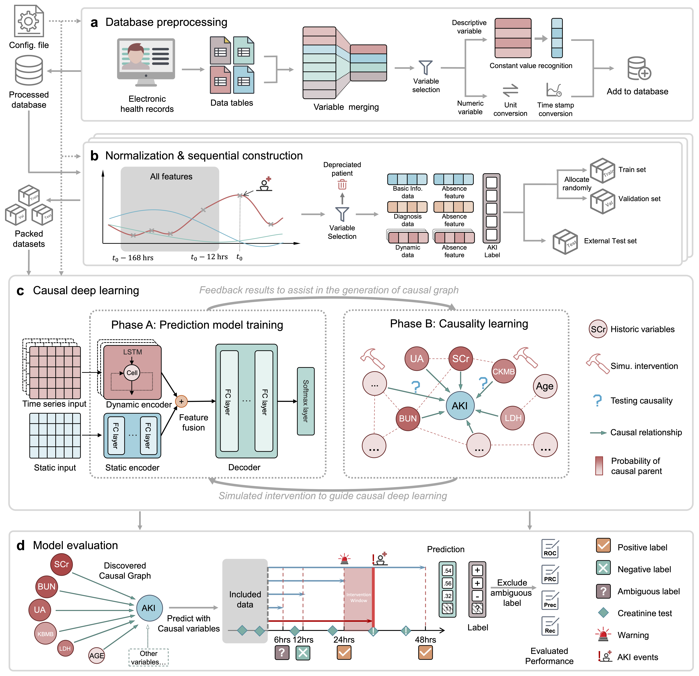
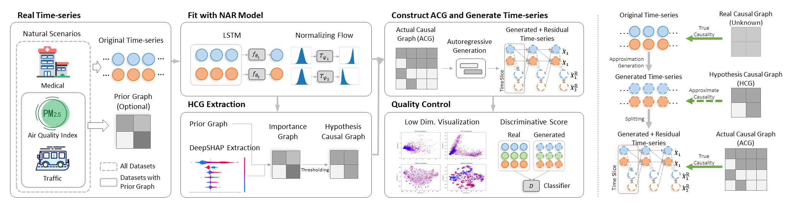

# UNN - Official Repository for Causal Neural Network

## Overview
This repository provides our latest research on Causal Neural Network. 

| Algorithm | Summary         | Paper | Code |
|--------|---------------------------------------------------------------------------|----| ----|
| CUTS  | EM-Style joint causal graph learning and missing data imputation for irregular temporal data |  [ICLR 2023](https://openreview.net/forum?id=UG8bQcD3Emv)   [Latest Version](CUTS/CUTS_ver0324_camera5.pdf) |[Code](CUTS/) 
| CUTS+  | Increasing scalability of neural causal discovery on high-dimensional irregular data. | Accepted to AAAI-24   [Supplements](CUTS_Plus/github_files/CUTS_Plus_Supp_ver1214.pdf)    [arXiv](https://arxiv.org/abs/2305.05890)|[Code](CUTS_Plus/) 
| CausalTime  Benchmark| A novel pipeline capable of generating realistic time-series along with a ground truth causal graph that is generalizable to different fields. [Official Website.](https://www.causaltime.cc/) |  [ICLR 2024](https://openreview.net/forum?id=iad1yyyGme) | [Code](CausalTime/)
| REACT | A causal deep learning approach that combines neural networks with causal discovery to develop a reliable and generalizable model to predict a patient's risk of developing CSA-AKI within the next 48 hours. | [medRxiv](https://www.medrxiv.org/content/10.1101/2023.12.04.23299332v1) | [Code](REACT/)

## 🏥 REACT: Ultra-efficient causal deep learning for Dynamic CSA-AKI Detection Using Minimal Variables
[medRxiv](https://www.medrxiv.org/content/10.1101/2023.12.04.23299332v1) | [Code🧑‍💻](REACT/) 

## 🍺 CausalTime: Realistically Generated Time-series for Benchmarking of Causal Discovery

[Official Website](https://www.causaltime.cc/) ｜ [ICLR 2024](https://openreview.net/forum?id=iad1yyyGme)  | [Generation Code🧑‍💻](CausalTime/) ｜ [Dataset Download](https://www.causaltime.cc/dataset/)

## 🎄CUTS+: High-dimensional Causal Discovery from Irregular Time-series
[arXiv](https://arxiv.org/abs/2305.05890) | [Code🧑‍💻](CUTS_Plus/) 

## 🚩 CUTS: Neural Causal Discovery from Irregular Time-Series Data

[ICLR 2023](https://openreview.net/forum?id=UG8bQcD3Emv) | [Latest Version](../CUTS/CUTS_ver0324_camera5.pdf) | [Code🧑‍💻](CUTS/) 

