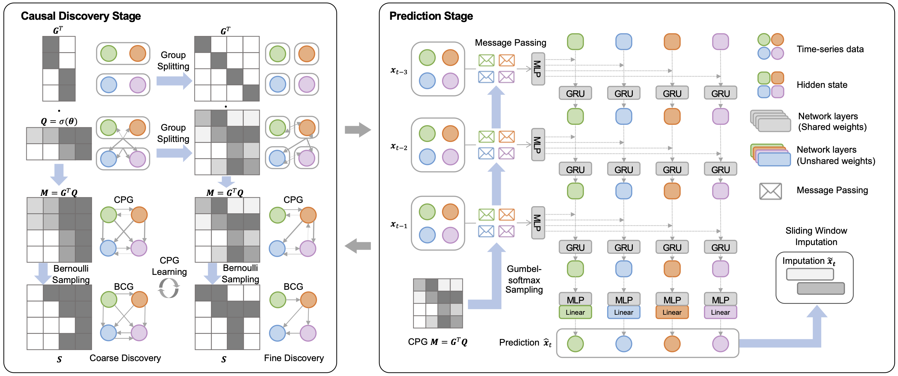

# UNN - Official Repository for Causal Neural Network

## Overview
This repository provides our latest research on Causal Neural Network. 

| Algorithm | Summary         | Paper | Code |
|--------|---------------------------------------------------------------------------|----| ----|
| CUTS  | EM-Style joint causal graph learning and missing data imputation for irregular temporal data |  [ICLR 2023](https://openreview.net/forum?id=UG8bQcD3Emv)   [Latest Version](CUTS/CUTS_ver0324_camera5.pdf) |[Code](CUTS/) 
| CUTS+  | Increasing scalability of neural causal discovery on high-dimensional irregular data. | [arXiv](https://arxiv.org/abs/2305.05890) |[Code](CUTS_Plus/) 
| CausalTime  Benchmark| A novel pipeline capable of generating realistic time-series along with a ground truth causal graph that is generalizable to different fields. [Official Website.](https://www.causaltime.cc/) | [arXiv](https://arxiv.org/abs/2310.01753) | [Code](CausalTime/)

## 🍺 CausalTime: Realistically Generated Time-series for Benchmarking of Causal Discovery

[Official Website](https://www.causaltime.cc/) ｜ [arXiv](https://arxiv.org/abs/2310.01753) | [Generation Code🧑‍💻](CausalTime/) ｜ [Dataset Download](https://www.causaltime.cc/dataset/)

## 🎄CUTS+: High-dimensional Causal Discovery from Irregular Time-series
[arXiv](https://arxiv.org/abs/2305.05890) | [Code🧑‍💻](CUTS_Plus/) 

## 🚩 CUTS: Neural Causal Discovery from Irregular Time-Series Data

[ICLR 2023](https://openreview.net/forum?id=UG8bQcD3Emv) | [Latest Version](../CUTS/CUTS_ver0324_camera5.pdf) | [Code🧑‍💻](CUTS/) 

